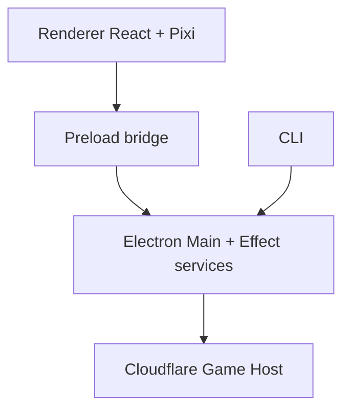

# Architecture

Tileborne is a pnpm + Turborepo monorepo. The OSS boundary keeps proprietary branding and deploy config in downstream private repos; the platform ships editor, CLI, runtime, and Cloudflare host templates.

## Repository layout

```text
tileborne/
  apps/
    desktop/          # Electron editor shell
    game-host/        # Cloudflare Workers + Durable Objects template
    docs/             # This documentation site (Astro Starlight)
  packages/
    core/             # Pure domain models
    runtime/          # Game runtime SDK
    plugin-api/       # Plugin manifest + contributions
    ipc-contracts/    # Desktop IPC schemas (Effect Schema)
    asset-pipeline/   # Import, pack, license, security
    cli/              # tileborne CLI
    ui/               # Editor React components
    services-*/       # Effect service graph (foundation, app, build, plugin)
    runtime-wasm/     # Optional WASM backends
    test-fixtures/    # CC0 sample fixtures for OSS tests/docs
  docs/               # Source specs and ADRs (synced into the docs site)
```

## Package map

| Package                     | Role                                                       |
| --------------------------- | ---------------------------------------------------------- |
| `@tileborne/core`           | IDs, geometry, map/project models, hashing, errors         |
| `@tileborne/runtime`        | Simulation, networking helpers, Pixi renderer adapter      |
| `@tileborne/plugin-api`     | Manifest schema, contribution registry, permissions        |
| `@tileborne/ipc-contracts`  | Typed IPC channels shared by main/preload/renderer         |
| `@tileborne/asset-pipeline` | Atomic imports, pack index, license reporting              |
| `@tileborne/cli`            | Developer-facing commands (project, asset, map, game, dev) |
| `@tileborne/services-*`     | Effect layers for filesystem, config, plugins, builds      |
| `@tileborne/ui`             | Editor shell components and declarative plugin UI mapping  |
| `@tileborne/desktop`        | Electron main/preload/renderer app                         |
| `@tileborne/game-host`      | Worker + DO room runtime bundled at deploy time            |

## Process boundaries



### Invariants

1. Renderer never imports Node, Electron, filesystem, or plugin executables.
2. Plugin executable code does not run in the renderer (Phase A).
3. All IPC channels live in `@tileborne/ipc-contracts` with Effect Schema.
4. CLI and Electron main share the same Effect service graph.
5. Game host bundles plugins at build time—no runtime disk discovery.
6. Asset import is atomic, content-hashed, path-safe, and license-aware.

## Related reading

- [Editor UX](/editor-ux/)
- [Runtime & Game Host](/runtime/)
- [Architecture Decisions](/adrs/)
- [API Reference](/reference/)
