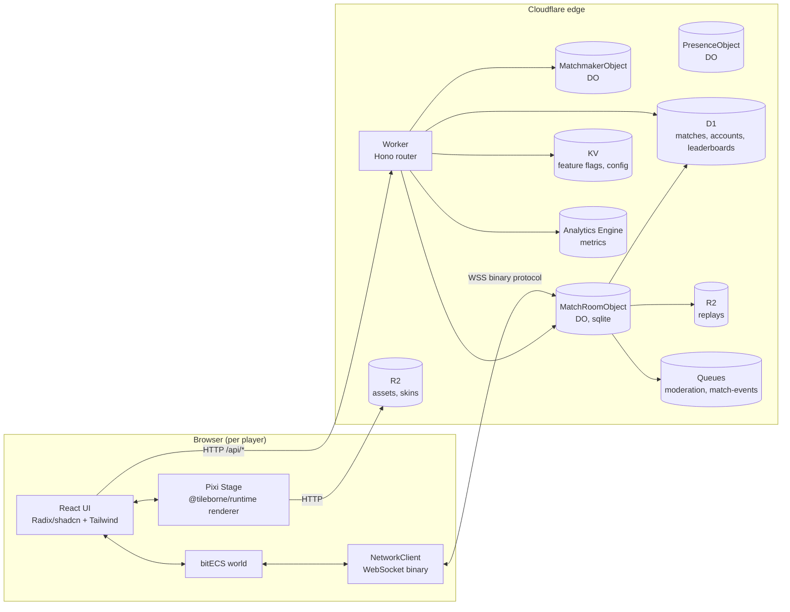

# Tileborne Runtime + Game-Host — UX / Architecture Specification

Status: Draft 1 (reverse-engineered from the Petwars Svelte+Phaser+Cloudflare app
at `/Users/kregenrek/projects/games/petwars/app/`).

This document is the canonical UX + architecture target for the new Tileborne
**runtime SDK** (`@tileborne/runtime`) and **game-host** (`apps/game-host`,
Cloudflare Workers + Durable Objects). It is implementation-agnostic enough
to be brand-neutral, but pins down enough behaviour that a build agent can
implement it without a second design pass.

Reference source: `/Users/kregenrek/projects/games/petwars/app/` (Svelte client,
Cloudflare Worker authoritative server, shared protocol/simulation, Alchemy
deploy config). Where Petwars has a clear pattern, this spec lifts it
verbatim with attribution; where the Tileborne architecture diverges
(React+Radix instead of Svelte, Pixi+bitECS instead of Phaser+ad-hoc state,
Effect services on the worker), the spec calls that out.

Companion specs:

- `./01-spec.md` — overall Tileborne architecture (§3 runtime, §13 runtime
  SDK, §14 Cloudflare deployment are the most relevant).
- `./02-editor-ux.md` — editor UX spec (tone, structure, length target).

---

## 1. Purpose & non-goals

### Purpose

- Define `@tileborne/runtime`: a renderer-agnostic, plugin-driven game
  runtime SDK that runs in the browser, on top of an ECS world (bitECS),
  with Pixi as the default 2D renderer adapter and an authoritative
  WebSocket protocol back to the game-host.
- Define `apps/game-host`: a Cloudflare Worker + Durable Object stack that
  hosts matches, runs the authoritative simulation, fans out snapshots,
  validates inputs, persists results, and exposes matchmaking + private
  rooms.
- Define the **game-host UX** as experienced by the client: lobby,
  matchmaking, room browser, loadout, in-match HUD, end-of-match, spectator,
  reconnect, errors. Mirror the proven Petwars flows but rebuild as React
  - Radix/shadcn + Pixi.
- Make the **plugin contribution model** symmetric between client (UI
  widgets, input maps, audio buses, client systems) and server (ECS systems,
  scoring, loot tables, validators), with `battle-royale` as the reference
  plugin and `petwars` as the reference brand product.

### Non-goals (v1)

- Native desktop client (the runtime is browser-first; an Electron wrapper
  is the editor's job, not the runtime's).
- Dedicated game servers outside Cloudflare. Workers + Durable Objects is
  the only target topology in v1.
- Custom in-renderer plugin code execution beyond declarative manifests +
  bundled plugin systems. Plugins are statically bundled into the
  client/host build in v1 (see §9 and `01-spec.md` §13).
- Real-time voice chat. Text chat only.
- Cross-region match migration. A match is born and dies inside the
  Durable Object that created it.
- Replay rendering UI. Replays are written to R2 (per Petwars alchemy
  config) but a viewer is deferred to v1.5.

---

## 2. Glossary

| Term          | Meaning                                                                                           |
| ------------- | ------------------------------------------------------------------------------------------------- |
| **runtime**   | `@tileborne/runtime` client SDK. ECS world, Pixi renderer adapter, net client, plugin host.       |
| **game-host** | `apps/game-host`. Cloudflare Worker + Durable Objects that own authoritative matches.             |
| **match**     | One playthrough end-to-end; owned by exactly one Match Durable Object instance.                   |
| **room**      | The DO instance that hosts a match. `room.id` is the DO id.                                       |
| **tick**      | One authoritative simulation step. Server tick rate is `serverHz` (Petwars: 60).                  |
| **snapshot**  | Authoritative world state at a tick, encoded for fanout.                                          |
| **delta**     | Snapshot variant that only encodes changed entities since the last baseline.                      |
| **plugin**    | A `TileborneRuntimePlugin` bundle that contributes client systems, server systems, contributions. |
| **brand**     | A private product (e.g. Petwars) that wraps the OSS runtime + a plugin + assets + branding.       |
| **handoff**   | Matchmaking → match transition via a short-lived `joinTicket` + `reconnectToken` pair.            |

---

## 3. High-level architecture



Boundary rules:

1. The **Pixi stage owns rendering only.** All durable game state lives in
   the ECS world; all authoritative state lives in the Match DO.
2. **React owns chrome (menus, HUD widgets, dialogs).** React reads ECS
   state via selectors; React never mutates ECS state.
3. **NetworkClient is the only entity allowed to touch the WebSocket.** It
   emits typed events into a bus that ECS systems and React selectors
   consume.
4. The Worker is **stateless** Hono routing; matches live in **Match DOs**.
   The Matchmaker DO is a small allocator; presence is a separate DO.

---

## 4. Runtime SDK (`@tileborne/runtime`)

### 4.1 Surface

Per `01-spec.md` §4 and §13, the runtime exposes:

```ts
export interface TileborneRuntimePlugin {
  id: string;
  setup(ctx: RuntimeSetupContext): Effect.Effect<void>;
}

export interface RuntimeSetupContext {
  world: World; // bitECS
  assets: RuntimeAssetLoader;
  renderer: RendererAdapter; // default: Pixi
  input: InputService;
  audio: AudioService;
  net: NetworkService;
  clock: DeterministicClock;
  brand: BrandConfig; // brand-injected: title, palette, lobby copy
  ui: ClientContributionRegistry; // HUD widget slots, settings panels, etc.
}
```

Package layout (per `01-spec.md` §3 `@tileborne/runtime`):

```
packages/runtime/src/
  runtime/
    game-runtime.ts            // boot + lifecycle
    game-loop.ts               // fixed-step accumulator (lift from petwars input.ts:consumeFixedInputTicks)
    deterministic-clock.ts
    input.ts                   // keyboard/mouse/gamepad/touch unification
  ecs/
    world.ts                   // bitECS World wrapper
    components.ts              // core components (Transform, Velocity, Renderable)
    systems.ts                 // system scheduler
  renderer/
    renderer-adapter.ts
    pixi/                      // PixiRendererAdapter, TilemapLayer, Sprite, Camera
  assets/
    runtime-asset-loader.ts    // R2-backed, content-hashed, cache-aware
  networking/
    protocol.ts                // binary framing helpers
    messages.schema.ts         // Effect Schema types
    network-client.ts          // WebSocket + reconnect + heartbeat
  plugins/
    runtime-plugin.ts
  ui/
    contribution-registry.ts   // HUD slot contracts
    hud-tokens.css             // CSS variables (lift from petwars hud-tokens.css)
```

### 4.2 Lifecycle

```text
boot()
  → load BrandConfig (brand splash, palette, copy)
  → load runtime manifest (server URL, build id, protocol version)
  → load plugin bundle(s) (declarative + executable, statically bundled)
  → create bitECS world
  → register plugin systems (client side)
  → mount Pixi renderer on <canvas>
  → load core asset bundle (atlas, font, ui sounds)
connect()
  → POST /api/auth/guest (or auth flow)
  → POST /api/matchmaking/join → MatchTicket
  → open WSS to ticket.wsUrl
join()
  → send ClientReady
  → receive Welcome (entityId, slot, mapWidth/Height, snapshotHz, seed)
  → receive PlayerLoadouts (skin ids)
  → receive SnapshotFull
loop()  // 60 Hz client tick, sendInputHz = 30
  → sample input → InputCommand
  → predict local entity (client-side prediction)
  → on SnapshotDelta → interpolate remotes, reconcile local
  → on Events → toast/kill-feed/audio
leave()
  → on close 4006 (MatchEnd) → render results modal
  → on close 4001 (kicked) → render kick reason
  → on unexpected close → /api/matches/:id/reconnect with reconnectToken
```

The fixed-step accumulator is lifted verbatim from petwars
`client/game/input.ts:consumeFixedInputTicks` (cap at `maxCatchupTicks=5`).

### 4.3 Determinism, prediction, interpolation

Petwars uses **authoritative server simulation + client-side prediction +
remote interpolation**. Tileborne adopts the same model.

| Setting                       | Value (lift from `SIMULATION` in `shared/constants/game.ts`) |
| ----------------------------- | ------------------------------------------------------------ |
| `serverHz`                    | 60                                                           |
| `snapshotHz`                  | 20 (every 3 server ticks)                                    |
| `clientInputHz`               | 60                                                           |
| `clientSendHz`                | 30                                                           |
| `maxInputCommands` per packet | 4                                                            |
| `maxQueuedInputCommands`      | 12                                                           |
| `maxInputFutureTicks`         | 24                                                           |
| `maxInputAgeTicks`            | 180                                                          |
| `lagCompensationMaxTicks`     | 18                                                           |
| Full-snapshot interval        | every `serverHz` ticks (1 s) (see `snapshots.ts`)            |
| Interpolation delay           | 2 snapshots (≈100 ms) for remote entities                    |

Client-side prediction: the local entity advances every client tick using
the same movement code as the server (`shared/simulation/movement.ts`,
moved to `@tileborne/runtime` so the worker can re-import it). On
SnapshotDelta the runtime reconciles by re-running unacknowledged inputs
from `lastProcessedInputSeq + 1`.

Interpolation: remote entities render at `serverTick - 2*snapshotInterval`
with linear position interp and `aimAngle` shortest-arc interp.

Determinism is **best-effort**, not strict. Floats and `Math.random` are
acceptable; the seed is shipped in `Welcome.seed` so future strict-deterministic
backends (per `01-spec.md` `@tileborne/runtime-wasm`) can lock in.

### 4.4 Plugin client API

Client plugins contribute systems and UI through the same declarative
manifest used by the editor (`01-spec.md` §8). Runtime-specific
contribution IDs:

| Contribution ID | Slot                                          | Example (battle-royale)             |
| --------------- | --------------------------------------------- | ----------------------------------- |
| `clientSystems` | Functions registered into the ECS schedule    | `safeZoneVisualSystem`              |
| `hudWidgets`    | React components mounted into named HUD slots | `SafeZoneTimer` → slot `top.right`  |
| `lobbyPanels`   | React panels mounted in the lobby modal       | `BR mode loadout panel`             |
| `inputMaps`     | Declarative key/button → action bindings      | `Drop weapon = Q`                   |
| `audioBuses`    | Named audio buses (music, sfx, ui)            | `gunfire` bus with sidechain duck   |
| `cameras`       | Camera controllers (follow, free, killcam)    | `KillcamController`                 |
| `interpolators` | Per-component interpolators                   | smooth health-bar tweening          |
| `assetPacks`    | R2-hosted bundles the runtime preloads        | `sample/grassland`                  |
| `errorMappers`  | Map server error codes to user-facing copy    | `BUILD_MISMATCH` → "Please refresh" |

Plugins MUST NOT touch the DOM outside the HUD slot they register into;
they MAY add Pixi `Container`s to named render layers (`world`, `vfx`,
`ui-world`).

### 4.5 Input, audio, asset loader

- **Input.** Single `InputState` shape with keyboard/mouse + gamepad +
  touch. Touch surfaces are rendered as overlay buttons on `pointerType
=== 'touch'` (Petwars `App.svelte` exposes `#touch-move` and `#touch-fire`;
  Tileborne lifts that). The `Button` bitmask and `createInputCommand`
  helper are lifted from `client/game/input.ts`.
- **Audio.** Web Audio with named buses (`master`, `music`, `sfx`,
  `ui`, `voice`). Plugins contribute additional buses. Settings dialog
  exposes per-bus volume sliders.
- **Asset loader.** Content-hashed R2 fetch, in-memory + IndexedDB
  cache, parallel `Promise.all` for atlases, single retry with backoff.
  Loader emits progress events to the React boot splash.

---

## 5. Client UX

The client UX is the in-browser surface of the runtime. It is React +
Radix/shadcn + Tailwind; the Pixi `<canvas>` sits underneath, sized by
the FIT+CENTER scale strategy lifted from `client/main.ts` (design
canvas 1920×1080, letterboxed, CSS variables `--game-rect-*` track the
canvas rect for HUD anchoring).

### 5.1 Brand boot splash

- Fullscreen splash while `runtime.boot()` runs.
- Brand product (e.g. petwars) injects a `BrandConfig`:

  ```ts
  type BrandConfig = {
    title: string; // "Petwars"
    logo: { src: string; alt: string };
    palette: HudPalette; // matches @tileborne/ui CSS vars
    lobbyCopy: { tagline: string; cta: string };
    legal: { tos: string; privacy: string };
  };
  ```

- Progress bar surfaces asset/plugin load. Errors render a runtime error
  panel (lift from `client/main.ts:renderBootError`).

### 5.2 Lobby / matchmaking

Maps to Petwars `MainMenu.svelte` + `PrivateRoomDialog.svelte` +
`LobbyWaitingDialog.svelte`.

- **Main menu (`<LobbyHome />`)**: "Play (Public)" CTA, "Create private
  room", "Join private room", "Skin / loadout", "Settings", "Account".
  Account drawer shows guest status or signed-in name; sign-in handled
  by `<AuthDialog />` (better-auth pattern lifted from `worker/auth/`).
- **Public match flow**: click Play → `POST /api/auth/guest` →
  `POST /api/matchmaking/join` → receive `MatchTicket` → open WSS →
  show `<LobbyWaitingDialog />` until phase reaches `Countdown`.
- **Private rooms (`<PrivateRoomDialog />`)**: configure `maxPlayers`,
  `timeLimitSeconds`, `friendlyFire`. POST `/api/rooms/private` returns
  a 6-char `roomCode` shown for sharing. Joining via code is a single
  field with paste support.
- **Lobby waiting**: shows player count `N/required`, region, map name,
  countdown when phase = `Countdown`. Last 3 s of countdown handoff
  to `<MatchDropCountdown />` (fullscreen). Lift the takeover constants
  (`DROP_TAKEOVER_SECONDS=3`, `DROP_FLASH_AFTER_RUNNING_MS=800`) from
  `client/ui/App.svelte`.
- **Party**: deferred to v1.5. Lobby exposes a disabled "Party" button
  with tooltip.

### 5.3 Loadout / settings / graphics / audio / controls

Single `<SettingsDialog />` (Radix Dialog) with vertical tabs:

| Tab           | Contents                                                                                                                                   |
| ------------- | ------------------------------------------------------------------------------------------------------------------------------------------ |
| Loadout       | Skin picker (`<SkinPickerDialog />` equivalent), primary/secondary/melee slots                                                             |
| Graphics      | `WorldViewPreset` (Hunter/Close/Default/Cinematic/Wide), pixel-art toggle, fps cap, low-spec mode                                          |
| Audio         | Bus sliders (master/music/sfx/ui), mute-on-focus-loss, hit-marker toggle                                                                   |
| Controls      | Key remap, gamepad deadzone, aim-sensitivity, aim-assist toggle (hook only)                                                                |
| Accessibility | Colorblind mode (`default`/`protan`/`deutan`/`tritan` — lift from `ui-state.svelte.ts:ColorBlindMode`), hud scale, captions, reduce motion |
| Account       | Sign in/out, email verification status, delete account                                                                                     |

Plugins MAY contribute additional tabs via `settingsPanels`.

### 5.4 In-match HUD

Mounted only when `matchPhase === Running`. React components in a
fixed-position layer that aligns to `--game-rect-*` so HUD widgets stay
inside the letterboxed game canvas. Source mapping (Svelte → React) per
§16.

| Slot                | Widget(s)                                                                   | Petwars source                                        |
| ------------------- | --------------------------------------------------------------------------- | ----------------------------------------------------- |
| `top.left`          | `<MatchInfo />` (alive/kills)                                               | `MatchInfo.svelte`                                    |
| `top.center`        | `<SafeZoneTimer />`                                                         | `SafeZoneTimer.svelte`                                |
| `top.right`         | `<TeamRoster />` / minimap                                                  | `TeamRoster.svelte`, `MinimapPlaceholder.svelte`      |
| `bottom.left`       | `<HealthArmorPanel />`, `<StatusEffectStrip />`                             | `HealthArmorPanel.svelte`, `StatusEffectStrip.svelte` |
| `bottom.center`     | `<WeaponCard />`, `<AmmoChips />`, `<EquipReloadProgress />`                | `WeaponCard.svelte`, `AmmoChips.svelte`               |
| `bottom.right`      | `<InventoryBar />`, `<HotkeyHints />`                                       | `InventoryBar.svelte`                                 |
| `right.feed`        | `<KillFeed />`, `<PickupToastBar />`                                        | `KillFeed.svelte`, `PickupToastBar.svelte`            |
| `overlay`           | `<HitDirectionIndicator />`, `<LowHealthVignette />`, `<StormEyeWarning />` | matching `.svelte` files                              |
| `overlay.tab`       | `<ScoreboardOverlay />` (hold-Tab)                                          | `ScoreboardOverlay.svelte`                            |
| `overlay.esc`       | `<EscMenuHint />` + Settings dialog                                         | `EscMenuHint.svelte`                                  |
| `overlay.objective` | `<MissionObjectiveCard />`                                                  | `MissionObjectiveCard.svelte`                         |

Chat is a thin `<ChatPanel />` anchored bottom-left, toggled by `Enter`,
backing the `MessageType.Chat` frame (already reserved in the Petwars
protocol). Server-authoritative throttle.

### 5.5 End-of-match results

- `<MatchResultsDialog />` (lift from `GameOverDialog.svelte`).
- Table: rank, name, kills, deaths, damage done/taken, score.
- Winner banner; local player row highlighted.
- Actions: `Play again`, `Back to menu`, `Report match` (POSTs
  `/api/reports/match`, lift from `client/net/client.ts:reportCurrentMatch`).
- Progression hook: brand product can mount `<ProgressionSummary />` into a
  named slot (XP/level/unlocks); core ships an empty default.

### 5.6 Spectator + reconnect

- **Reconnect.** Server sends WS close code; client maps:
  - `4001` → kicked (no auto-reconnect)
  - `4006` → match ended (no reconnect, show results)
  - any other → call `/api/matches/:roomId/reconnect` with the
    stored `reconnectToken`; on success, reopen WS to the new
    `wsUrl`. Lift the policy from `client/net/client.ts:reconnect`.
- **Spectator.** v1: after local death, camera stays on the entity and
  the killer arrow points to the attacker (existing
  `<HitDirectionIndicator />`). True killcam (camera follows killer with
  rewind 2 s) is deferred; the runtime ships a `KillcamController`
  contribution point but core leaves it stubbed.

### 5.7 Error, empty, loading, offline

| State                        | Treatment                                                                  |
| ---------------------------- | -------------------------------------------------------------------------- |
| WS connect fail              | Toast + "Retry" CTA in lobby.                                              |
| `BUILD_MISMATCH` (409)       | Modal: "A new version is available. Refresh." Disable Play.                |
| `MATCHMAKING_DISABLED`       | Lobby banner: "Matchmaking is paused. Try again later."                    |
| Rate limited (429)           | Inline error + countdown to retry.                                         |
| Origin denied (403)          | Modal: "This game must be played from <official URL>."                     |
| Offline (`navigator.onLine`) | Disable Play; show "You are offline."                                      |
| Loading                      | Boot splash → lobby skeleton → lobby. No flash of unauthenticated content. |

### 5.8 Accessibility

- All Radix primitives keep their ARIA. We never strip it.
- `--hud-scale` CSS variable drives HUD widget scaling; Settings
  exposes 80/100/120/150%.
- Colorblind palettes swap the `--accent-friendly` / `--accent-hostile`
  pair. Tested with the 4 modes from `ui-state.svelte.ts`.
- Key remap exposes every action; remappings persist in
  `localStorage` under `tileborne.input.bindings`.
- `prefers-reduced-motion`: disable hit-flash vignette pulse, drop
  countdown bounce, results screen confetti.
- Touch: when `pointerType === 'touch'` the runtime renders
  `<TouchMovePad />` + `<TouchFireButton />` (lift from petwars
  App.svelte `#touch-move` / `#touch-fire`).

---

## 6. Input & camera

### 6.1 Input

Lift `client/game/input.ts` verbatim into `@tileborne/runtime/runtime/input.ts`,
with these extensions:

- Add a `GamepadSource` that maps left stick → `moveX/moveY`, right stick
  → aim, right trigger → `Fire`, A/B/X/Y → ability/interact/reload/drop.
- Add a `TouchSource` driving the same `InputState`.
- Bindings are declarative, plugin-extensible (`inputMaps` contribution).

`InputCommand` wire format stays at 20 bytes (header-aligned; see §8).

### 6.2 Camera

Camera is a service on the renderer adapter, not in ECS:

| Mode       | Behaviour                                                               |
| ---------- | ----------------------------------------------------------------------- |
| `follow`   | Center on local entity; clamp to playable bounds.                       |
| `freeAim`  | Camera follows but biases toward the cursor (lift `WORLD_VIEW_DESIGN`). |
| `killcam`  | Plugin-contributed; rewinds 2 s and follows the killer.                 |
| `spectate` | Free pan, snap-to-player on click.                                      |

`WORLD_VIEW_PRESETS` (Hunter/Close/Default/Cinematic/Wide) ships in core;
players pick one in Settings → Graphics.

Aim assist is a **contribution point** with a no-op default. Plugins
(e.g. battle-royale) may register an aim-assist function that nudges
`aimAngle` toward the closest enemy within a configurable cone. Aim
assist is always client-side; the server never applies it.

---

## 7. Game-host (`apps/game-host`)

Per `01-spec.md` §13–§14, plus reverse-engineered from
`petwars/app/src/worker/`.

### 7.1 Topology

```
apps/game-host/
  src/
    worker.ts                 // Hono router (lift from worker/index.ts)
    env.ts                    // typed Env bindings
    http.ts                   // jsonError, parseJson helpers
    routes/
      health.ts               // GET /health
      discover.ts             // GET /discover  (capabilities, build id, protocol version)
      auth.ts                 // POST /api/auth/guest (better-auth)
      matchmaking.ts          // POST /api/matchmaking/join
      rooms.ts                // POST /api/rooms/private, /:code/join
      matches.ts              // POST /api/matches/:id/reconnect, GET stats
      reports.ts              // POST /api/reports/match
      leaderboards.ts         // GET /api/leaderboards/global
      bootstrap.ts            // GET /api/bootstrap (build id, feature flags)
      dev.ts                  // POST /api/dev/{reset,force-start} (non-prod)
      playtest.ts             // POST /api/playtest/start (editor handoff)
    rooms/
      match-room-object.ts    // MatchRoomObject DO
      matchmaker-object.ts    // MatchmakerObject DO
      presence-object.ts      // PresenceObject DO
      room-support.ts         // pure helpers, lift from petwars
      snapshots.ts            // baseline + delta encoding (lift)
      snapshot-backpressure.ts
      socket-limits.ts
      input-queue.ts
    matchmaking/
      shards.ts               // per-region shard names
      tickets.ts              // joinTicket + reconnectToken
      room-policy.ts          // requiredPlayers, friendlyFire, etc.
    persistence/
      matches.ts              // D1 writes
      accounts.ts
      reports.ts
    security/
      origin.ts               // origin allowlist
      turnstile.ts            // Cloudflare Turnstile
      rate-limits.ts          // RateLimit bindings
    observability/
      events.ts               // Analytics Engine (lift)
      request-log.ts          // structured request logging
    queues/
      handler.ts              // moderation, match-events, skin-generation
    services/
      runtime-effect.ts       // Effect service layer for the worker
    bundled-plugin.ts         // statically-bundled plugin systems
    bundled-assets.ts         // manifest of preloaded asset URLs
  alchemy.run.ts              // Alchemy deploy config (lift)
  migrations/                 // D1 migrations
  wrangler.template.toml
```

Hono routing follows petwars `worker/index.ts`. The `app.notFound` falls
back to static asset serving via the Workers Assets binding.

### 7.2 Match Durable Object

Lifted from `petwars/app/src/worker/durable-objects/MatchRoomObject.ts`
(1372 lines, the heaviest DO). Tileborne renames to
`MatchRoomObject` and keeps the SQLite-backed DO option (`sqlite: true`
in the Alchemy binding).

States:

```
waiting → countdown → running → ended
                   ↘ aborted (admin or all players left during countdown)
```

Lifecycle per tick (server `loopTimer` runs `setTimeout` at `stepMs` =
1000/60 ms, with a fixed-step accumulator and `maxCatchupTicks=5`):

1. Drain input queues (per-player ring of `maxQueuedInputCommands=12`).
2. Apply movement (`applyMovement`).
3. Apply combat (`applyCombatForCommand`), projectiles, melee, abilities.
4. Apply pickups, interactables, status effects.
5. Apply safe-zone damage (BR-specific plugin system; opt-in).
6. Advance respawn timers (BR mode disables respawn).
7. Snapshot: every `snapshotIntervalTicks=3` produce a delta; every
   `serverHz` ticks (~1 s) force a full snapshot via
   `createSnapshotBaseline`/`encodeAuthoritativeSnapshot`.
8. Fan out snapshot to all `ctx.getWebSockets()` with backpressure
   (`snapshot-backpressure.ts`).
9. Persist history frame (last `lagCompensationMaxTicks=18` ticks) for
   server-side rewind.
10. Emit observability events to Analytics Engine.

DO storage (per match):

| Key              | Value                                                              |
| ---------------- | ------------------------------------------------------------------ |
| `runtimeMapRef`  | `{ mapPackage, procgenSignature }`                                 |
| `roomRules`      | `RoomRules` (maxPlayers, timeLimit, friendlyFire, disabledWeapons) |
| `ticket:<id>`    | Pending join ticket                                                |
| `reconnect:<id>` | Reconnect token (TTL `RECONNECT_TOKEN_TTL_MS`)                     |
| `match:current`  | `MatchRecord` (matchId, startedAt, status, players)                |

Snapshot/delta encoding: `shared/protocol/messages.ts` (Petwars) is
lifted verbatim into `packages/ipc-contracts/src/wire/` (see §8).

### 7.3 Matchmaker DO

Per `MatchmakerObject.ts`. Sharded by region (5 in petwars: `weur`,
`eeur`, `enam`, `wnam`, `apac`). Each region maintains a list of open
rooms; `joinPublic` finds the oldest non-full room or creates a new one,
generates a `joinTicket`, and returns `(roomId, slot, joinTicket,
reconnectToken, wsUrl)`. Private rooms are a separate code-keyed table
in the same DO.

Allocation policy is lifted from `matchmaking/room-policy.ts` and
exposed as a `roomPolicy` plugin contribution so brand products can tune
`requiredPlayers`, time-limit defaults, and disabled weapons per stage.

### 7.4 Asset / CDN strategy

- **R2 `assets` bucket.** Atlases, fonts, audio. Content-addressed paths
  `<hash>.<ext>`. Bucket is public-read via a Worker route
  (`/cdn/<path>`); the worker injects `Cache-Control: public, max-age=31536000, immutable`.
- **R2 `skins` bucket.** User-generated content. 30-day lifecycle on
  upload sources (lift from petwars alchemy.run.ts).
- **R2 `replays` bucket.** Match replays as binary frame logs. Transition
  to Infrequent Access after 30 days, expire after 180.

### 7.5 Persistence

| Store          | What lives there                                                            |
| -------------- | --------------------------------------------------------------------------- |
| **D1**         | accounts, matches, match_players, reports, leaderboards, skins, credentials |
| **DO storage** | per-room ephemeral state (rules, tickets, reconnect tokens)                 |
| **KV**         | feature flags, server config, asset manifest, build allowlist               |
| **R2**         | static assets, user skins, replays                                          |
| **AE**         | Analytics Engine dataset for metrics & event funnels                        |

Migrations live in `apps/game-host/migrations/` (lift Petwars layout).

### 7.6 Anti-cheat surface

Server-authoritative checks (all already in petwars):

- **Build id allowlist** (`BUILD_MISMATCH` 409).
- **Origin check** for non-public endpoints (`worker/security/origin.ts`).
- **RateLimit bindings** for auth, matchmaking, upload, report, skin
  generation.
- **Input validation**: `clientTick` clamped to `[serverTick -
maxInputAgeTicks, serverTick + maxInputFutureTicks]`; `moveX/moveY`
  bounded to ±127; `aimAngle` is 16-bit unsigned; weapon/ability ids
  validated against the room's catalog.
- **Server-only damage resolution**: clients never deal damage; combat
  runs in the DO using rewind-aware hit checks.
- **Friendly fire** is a room rule, not a client toggle.
- **Turnstile** challenge on signup, skin generation, and report.
- **Socket caps**: `socket-limits.ts` enforces per-socket inbound rate.
- **DLQs**: moderation, match-events, skin-generation queues each have
  a 14-day DLQ.

Sandboxed plugin execution boundary: plugin **systems** that run inside
the DO run with the same trust as the host; in v1 the only mitigation
is that plugins are statically bundled at build time. Phase B will move
plugin systems behind a structured-clone IPC barrier so a malicious
plugin can be revoked without redeploying the host.

### 7.7 Region / sharding / scale-out

- One MatchmakerObject per region (`weur|eeur|enam|wnam|apac`). DO
  scaling is implicit (Cloudflare colocates DOs near the requesting
  Worker), so the Worker picks the user's region from `cf-ipcountry`
  with a manual override in Settings.
- Match DOs scale horizontally: each match is a fresh DO instance.
- Private rooms allocate inside a dedicated private shard
  (`privateMatchmakerShard`) so a flood of private rooms can't starve
  public matchmaking.

### 7.8 Observability

- **Logs.** `worker/observability/request-log.ts` middleware logs every
  request as structured JSON.
- **Events.** `emitEvent(env, eventName, fields)` writes to Analytics
  Engine with redacted user ids (lift from petwars events.ts).
- **Traces.** OpenTelemetry via `wrangler` `--tail`; tracing IDs flow
  through `x-request-id`.
- **Error reporting.** Cloudflare Logpush → Sentry (or equivalent).
  Brand product wires the DSN.
- **Per-match metrics.** ticks/s, snapshots sent/dropped (backpressure),
  avg inputs/tick, mean RTT (from pings), reconnect rate.

---

## 8. Wire protocol (`@tileborne/ipc-contracts`)

The wire protocol moves into `packages/ipc-contracts/src/wire/` so both
the runtime (browser) and the game-host (worker) share the exact same
codec. Schema versioning lives in `PROTOCOL_VERSION` (currently 14 in
petwars; Tileborne resets to 1 with a clean rebrand).

### 8.1 Transport

- **HTTP/JSON** for matchmaking, auth, reports, leaderboards, bootstrap,
  reconnect. Hono on the worker; `fetch` on the client.
- **WebSocket (binary, `ArrayBuffer`)** for the match channel. The room
  DO upgrades on `GET /ws/room/:roomId`. The client connects to
  `ticket.wsUrl` directly.

### 8.2 Frame header

Every frame is `[protocolVersion u8][messageType u8][sequenceOrTick u32 LE]`
(6 bytes), per `shared/protocol/messages.ts`. Header reader throws on
`protocolVersion` mismatch.

### 8.3 Message types

| Id  | Name             | Direction | Notes                                                 |
| --- | ---------------- | --------- | ----------------------------------------------------- |
| 1   | `Welcome`        | S → C     | entityId, slot, mapWidth/Height, snapshotHz, seed     |
| 2   | `ClientReady`    | C → S     | sent after Welcome decoded                            |
| 3   | `InputBatch`     | C → S     | up to 4 `InputCommand`s, 20 bytes each                |
| 4   | `SnapshotFull`   | S → C     | players + pickups + decoys + safeZone                 |
| 5   | `SnapshotDelta`  | S → C     | only changed entities                                 |
| 6   | `Events`         | S → C     | kill/damage/pickup/ability/etc. event bus             |
| 7   | `Ping`           | C ↔ S     | 1 Hz heartbeat                                        |
| 8   | `Pong`           | S ↔ C     | reply                                                 |
| 9   | `Chat`           | C ↔ S     | text chat                                             |
| 10  | `MatchEnd`       | S → C     | winner + per-player results; server closes with 4006  |
| 11  | `ServerNotice`   | S → C     | banner messages (e.g. "Server restart in 60 s")       |
| 12  | `PlayerLoadouts` | S → C     | skin ids (variable-length strings, 4 + N bytes/entry) |

### 8.4 RPC contracts (HTTP)

JSON, Effect-Schema-validated. Notable endpoints:

| Method | Path                             | Purpose                                                |
| ------ | -------------------------------- | ------------------------------------------------------ |
| POST   | `/api/auth/guest`                | Issue guest session cookie                             |
| POST   | `/api/matchmaking/join`          | Request a `MatchTicket`                                |
| POST   | `/api/rooms/private`             | Create a private room (returns `{ roomCode }`)         |
| POST   | `/api/rooms/private/:code/join`  | Join private room → `MatchTicket`                      |
| POST   | `/api/matches/:roomId/reconnect` | Refresh a ticket using `reconnectToken`                |
| POST   | `/api/reports/match`             | Submit a moderation report                             |
| GET    | `/api/bootstrap`                 | Build id, feature flags, min client build              |
| GET    | `/api/leaderboards/global`       | Global leaderboard                                     |
| GET    | `/health`, `/discover`           | Liveness + capability discovery (per `01-spec.md` §14) |

### 8.5 Schema versioning + handshake

- Client sends its build id in matchmaking requests; server rejects
  with `BUILD_MISMATCH` (409) if `clientBuildId < minimumClientBuildId`.
- WS handshake: first frame from server MUST be `Welcome`; first frame
  from client MUST be `ClientReady`. Out-of-order frames during
  handshake close the socket with `4001`.
- `PROTOCOL_VERSION` is part of every header; mismatch closes the
  socket.

### 8.6 Auth

- Better-auth-compatible session cookie issued by `/api/auth/guest` or
  `/api/auth/login`. The same cookie authorises matchmaking; the
  resulting `joinTicket` is the only credential needed for the WS
  upgrade (`/ws/room/:roomId` reads `ticketId` from the URL and validates
  it against DO storage).
- Reconnect uses `reconnectToken` (HMAC + TTL) instead of re-issuing the
  cookie.

---

## 9. Server plugin contributions

Server plugins contribute to the simulation tick. Contribution surface:

| Contribution ID | Slot                                          | Example (battle-royale)                         |
| --------------- | --------------------------------------------- | ----------------------------------------------- |
| `serverSystems` | Functions registered into the DO tick loop    | `safeZoneDamageSystem`                          |
| `roomRules`     | Default `RoomRules` + admissible overrides    | `requiredPlayers: 16`, `respawnEnabled: false`  |
| `scoring`       | Score calculators (kill, survival, objective) | `killScore: 100`, `survivalScorePerInterval: 1` |
| `lootTables`    | Loot-table definitions referenced by maps     | `grassland-default` table                       |
| `weaponCatalog` | Weapon stat definitions                       | `WEAPONS` from `shared/constants/game.ts`       |
| `mapValidators` | Server-side map validation rules              | "minimum 16 spawn points"                       |
| `matchPhases`   | State machine extensions (e.g. capture phase) | n/a in BR                                       |
| `replayWriters` | Per-match writers to R2 `replays`             | `BinaryFrameLogWriter`                          |

Brand products configure plugins via `BrandConfig.servers`. Example for
petwars:

```ts
{
  plugin: "@tileborne-plugins/battle-royale",
  roomRules: { maxPlayers: 16, timeLimitSeconds: 600, friendlyFire: false },
  weaponBalance: "balance_001",
  lootTable: "grassland-default",
  replays: { enabled: true, prefix: "petwars/" },
}
```

The host **statically bundles** the chosen plugin at `tileborne game
build --plugin <id> --target cloudflare` (per `01-spec.md` §13). There
is no dynamic plugin loading inside Workers.

---

## 10. Deployment via Alchemy

The deploy pattern is lifted verbatim from `petwars/app/alchemy.run.ts`.

### 10.1 `alchemy.run.ts` shape

```ts
const app = await alchemy('<brand-name>', { password: alchemyPassword });

const db = await D1Database('db', { migrationsDir: 'migrations', adopt: true });
const matchmaker = DurableObjectNamespace<MatchmakerObject>('matchmaker', {
  className: 'MatchmakerObject',
  sqlite: true,
});
const matchRoom = DurableObjectNamespace<MatchRoomObject>('match-room', {
  className: 'MatchRoomObject',
  sqlite: true,
});
const presence = DurableObjectNamespace<PresenceObject>('presence', {
  className: 'PresenceObject',
  sqlite: true,
});

const assets = await R2Bucket('assets', { adopt: true });
const skins = await R2Bucket('skins', {
  lifecycle: [
    /* expire uploads after 30d */
  ],
});
const replays = await R2Bucket('replays', {
  lifecycle: [
    /* IA→30d, expire→180d */
  ],
});

const config = await KVNamespace('config', { adopt: true });

const moderationDlq = await Queue('moderation-dlq', {
  settings: { messageRetentionPeriod: 14 * 24 * 3600 },
});
const matchEventsDlq = await Queue('match-events-dlq', {
  settings: { messageRetentionPeriod: 14 * 24 * 3600 },
});
const moderationQueue = await Queue('moderation', { dlq: moderationDlq });
const matchEventsQueue = await Queue('match-events', { dlq: matchEventsDlq });

const analytics = AnalyticsEngineDataset('analytics', {
  dataset: `${app.name}_${app.stage}_metrics`,
});

export const website = await Vite('website', {
  entrypoint: 'src/worker.ts',
  assets: 'dist/client',
  compatibility: 'node',
  eventSources: [
    /* moderationQueue, matchEventsQueue */
  ],
  bindings: {
    DB: db,
    MATCHMAKER: matchmaker,
    MATCH_ROOM: matchRoom,
    PRESENCE: presence,
    ASSETS_BUCKET: assets,
    SKINS_BUCKET: skins,
    REPLAYS_BUCKET: replays,
    CONFIG_KV: config,
    MODERATION_QUEUE: moderationQueue,
    MATCH_EVENTS_QUEUE: matchEventsQueue,
    ANALYTICS: analytics,
    AUTH_RATE_LIMIT: RateLimit({
      /* per-stage namespace ids */
    }),
    MATCHMAKE_RATE_LIMIT: RateLimit({
      /* ... */
    }),
    ENVIRONMENT: app.stage,
    BETTER_AUTH_SECRET: secretBinding('BETTER_AUTH_SECRET'),
    /* brand-specific bindings injected here */
  },
});
```

### 10.2 Environments

- `local`, `dev`, `staging`, `production` stages. Rate-limit namespace ids
  are stage-keyed (lift `stageRateLimitNamespaces` from petwars).
- Trusted-origins env var is **required** in staging/production (lift
  `trustedOriginsBinding`).
- Secrets are passed via `alchemy.secret(...)` when `ALCHEMY_PASSWORD`
  is set; production/staging refuse to deploy without it.

### 10.3 Custom domains, preview, rollback

- Custom domain per brand (e.g. `play.petwars.com`). Routed via Alchemy
  custom-domain resource (deferred wiring — brand-owned).
- Preview deploys per PR via `alchemy dev --stage pr-<n>`.
- Rollback: `wrangler rollback` on the Worker; D1 rolls back via
  prior-migration replay (test in staging only).

---

## 11. Testing

Lift the Petwars test layout (`app/tests/{unit,integration,load}`).

### 11.1 Test buckets

| Bucket          | Examples                                                                                                                                                        |
| --------------- | --------------------------------------------------------------------------------------------------------------------------------------------------------------- |
| **Unit**        | `protocol.test.ts` (encode/decode roundtrip), `combat.test.ts`, `safe-zone.test.ts`, `input.test.ts`, `local-player-snapshot.test.ts`. Pure TS, no Workers env. |
| **Integration** | `worker-runtime.test.ts` running against the Workers vitest pool (`@cloudflare/vitest-pool-workers`). Drives a real DO with `unstable_DurableObjectId`.         |
| **Load**        | `tests/load/` headless WS clients hammering a local Worker. Asserts snapshot fanout cost, backpressure behaviour, and reconnect under packet loss.              |

### 11.2 Headless match harness

A `MatchHarness` lives in `@tileborne/test-fixtures`:

```ts
const harness = await MatchHarness.start({ plugin: '@tileborne-plugins/battle-royale' });
const [a, b] = await Promise.all([harness.joinBot('a'), harness.joinBot('b')]);
await harness.advanceTicks(600); // 10 s
expect(harness.players()).toMatchSnapshot();
```

The harness uses `unstable_dev` (Workers) + a fake WebSocket that drives
the binary protocol directly. Plugins can register their own harness
extensions.

### 11.3 Deterministic sim tests

Pure simulation tests run the shared `applyMovement` / `applyCombat`
functions outside of any DO and assert tick-by-tick state given a fixed
seed. These guard against accidental floating-point divergence between
client prediction and server authority.

---

## 12. Performance budgets

| Surface                    | Budget                                                                               |
| -------------------------- | ------------------------------------------------------------------------------------ |
| Server tick                | 60 Hz, ≤ 8 ms CPU per tick at 16 players (Workers CPU limit: see DO best practices). |
| Snapshot fanout            | ≤ 2 KB per delta per player; full snapshot ≤ 8 KB at 16 players.                     |
| Snapshot rate              | 20 Hz delta; 1 Hz forced full.                                                       |
| Client FPS                 | 60 fps at 1080p; degrade to 30 fps on low-spec mode (preset "Hunter").               |
| Client input → server lag  | p50 ≤ 60 ms regional, p95 ≤ 150 ms.                                                  |
| Reconnect time             | ≤ 2 s from drop to playable.                                                         |
| Asset preload (cold)       | ≤ 3 s for core atlas + UI; map-specific atlases stream on demand.                    |
| Match DO storage per match | ≤ 200 KB (history frames + rules + tickets + match record).                          |
| Replay write               | < 1 MB / minute of match.                                                            |

---

## 13. Security

- Authoritative server, period. The client is treated as adversarial.
- Origin check on all `/api/*` and on the WS upgrade.
- Cloudflare Turnstile on signup, skin upload, skin generation, reports.
- Rate limits on every untrusted entry point (lift Petwars namespaces).
- Server-side validation of every `InputCommand` (tick range, weapon/ability ids).
- All damage, pickups, ability cooldowns, and movement decisions made
  server-side using shared simulation code.
- Plugin execution is **bundled at build time**; phase B will move
  plugin systems behind an IPC boundary inside the DO.
- Secrets via `alchemy.secret(...)`; never read from `process.env` at
  runtime in production.
- D1 schema enforces `NOT NULL` on auth keys; better-auth migrations
  are tracked in `migrations/`.
- Reports → moderation queue → human review (deferred admin tooling).

---

## 14. Observability + ops runbook

### 14.1 Signals

- **Liveness**: `GET /health` returns 200 + build id.
- **Match metrics**: ticks/s, mean RTT, snapshots dropped (backpressure),
  reconnect count, kicks per code.
- **Error budget**: count of `5xx` per route per stage; alert on >1% over
  5 min.
- **Cost telemetry**: DO billable duration via wrangler analytics.

### 14.2 Runbook entries (outline)

1. **Matchmaking stalled** (`pendingPlayers > requiredPlayers` for >2 min):
   check `publicMatchmakingEnabled` flag, region selection, build allowlist.
2. **Snapshots dropped** (`backpressure` events spiking): inspect
   `snapshot-backpressure.ts` thresholds; consider lowering `snapshotHz`
   per-room.
3. **Reconnect storm**: spike in `/api/matches/:id/reconnect`; check
   recent deploy, WS close codes.
4. **DO storage near limit**: prune history frames; clamp
   `maxQueuedInputCommands`.
5. **Replay bucket bloat**: verify lifecycle rules; rotate prefix.

---

## 15. State management

Symmetric to `01-spec.md` §16 (editor) but for the runtime client + the
worker.

### 15.1 Client (browser)

- **TanStack Query** for HTTP state: `useBootstrap()`, `useAccount()`,
  `useSkinCatalog()`, `useLeaderboard()`. No WS state here.
- **Zustand store `useRuntimeStore`** for non-ECS UI state:
  matchPhase, countdownStartedAtMs, lobbyOpen, settingsOpen, errors,
  kill-feed view-model. Mirrors petwars `ui-state.svelte.ts`.
- **bitECS World** for in-match entity state. React selectors subscribe
  via `useFrameSelector(world, query)` (custom hook, polls once per
  rAF; never re-renders inside the Pixi loop).
- **Pixi-local**: tilemap chunks, sprite atlases, particle pools.
- **NetworkClient** event bus → bridges WS events into the Zustand store
  - ECS world. Modelled on petwars `game-client-bridge.ts`.

Boundary check: a CI test (`packages/runtime/tests/boundary.test.ts`)
fails the build if the runtime entry bundle imports React.

### 15.2 Worker (Cloudflare)

- **Effect service graph** for everything reusable: `AuthService`,
  `MatchmakingService`, `ReportsService`, `LeaderboardsService`,
  `FeatureFlagsService`. Routes are thin Hono handlers that resolve a
  service from the layer and run it.
- **Per-DO instance state** is local class state in the DO; storage is
  in `ctx.storage` (sqlite-backed where allowed).
- **No globals**: all environment access goes through the typed `Env`
  binding.

---

## 16. Open questions / deferred

1. **Strict determinism.** Should the runtime adopt fixed-point math /
   integer-only sim so the WASM backend (`@tileborne/runtime-wasm`) can
   plug in with no behaviour change? Defer to ADR.
2. **Replay UI.** Replays are written to R2 but there is no viewer yet.
   v1.5 — needs a `<ReplayPlayer />` component spec.
3. **Voice chat.** Not in v1. If we add it, WebRTC via SFU? Or
   Cloudflare Realtime? ADR-gated.
4. **Cross-region match join.** Today a match is bound to a regional
   shard. Should the client be allowed to manually pick a region and
   accept higher RTT? Currently exposed in Settings as a hint only.
5. **Killcam with rewind.** The history buffer (18 ticks) is too short
   for a 2 s killcam. Either extend the buffer or persist a rolling 5 s
   ring on the DO. Cost vs UX trade.
6. **Plugin sandboxing on the host (Phase B).** Static bundling is the
   v1 boundary. The phase-B IPC barrier needs an ADR; structured-clone
   message passing or worker-in-worker?
7. **Authoritative chat moderation.** Current petwars setup queues
   reports for human review. Should we add an inline LLM filter via a
   bound AI Gateway, or stick with the queue + human loop?
8. **Spectator after death.** v1 leaves the camera on the local body
   and shows kill direction. Should we add free-cam spectate of any
   surviving player? Cheating risk vs UX.
9. **Brand-specific scoring overrides.** `scoring` contribution lets
   brands tweak score values, but the UI doesn't currently surface
   per-brand scoring rules. Settle whether the lobby shows "Score: kill
   100 / survive +1/s" or hides it.
10. **Wire protocol version negotiation.** Today the header carries a
    single `PROTOCOL_VERSION` byte and any mismatch is fatal. Consider
    adding a `supportedVersions[]` array in `/discover` so brand
    products can run mixed-build canaries.

These questions do **not** block implementation of the v1 slice; they
affect later passes.

---

## 17. Reference — petwars Svelte/Worker → Tileborne React/Worker mapping

| Petwars source                                                | Feature                                                                                                                                  | Tileborne target                                                                    | Package                            |
| ------------------------------------------------------------- | ---------------------------------------------------------------------------------------------------------------------------------------- | ----------------------------------------------------------------------------------- | ---------------------------------- |
| `app/src/client/main.ts`                                      | Boot, Phaser scale, brand boot                                                                                                           | `packages/runtime/src/runtime/game-runtime.ts` + `apps/<brand>-client/src/main.tsx` | `@tileborne/runtime` + brand       |
| `app/src/client/ui/App.svelte`                                | Top-level UI shell + ESC/Tab handlers                                                                                                    | `<RuntimeRoot />` (React)                                                           | `@tileborne/runtime` UI            |
| `app/src/client/ui/flows/MainMenu.svelte`                     | Lobby home                                                                                                                               | `<LobbyHome />`                                                                     | `@tileborne/runtime` UI            |
| `app/src/client/ui/flows/PrivateRoomDialog.svelte`            | Private room creation/join                                                                                                               | `<PrivateRoomDialog />`                                                             | `@tileborne/runtime` UI            |
| `app/src/client/ui/flows/LobbyWaitingDialog.svelte`           | Matchmaking lobby                                                                                                                        | `<LobbyWaitingDialog />`                                                            | `@tileborne/runtime` UI            |
| `app/src/client/ui/flows/MatchDropCountdown.svelte`           | Pre-match drop overlay                                                                                                                   | `<MatchDropCountdown />`                                                            | `@tileborne/runtime` UI            |
| `app/src/client/ui/flows/SettingsDialog.svelte`               | Settings modal                                                                                                                           | `<SettingsDialog />` (Radix Dialog + tabs)                                          | `@tileborne/runtime` UI            |
| `app/src/client/ui/flows/SkinPickerDialog.svelte`             | Skin picker                                                                                                                              | `<LoadoutPicker />`                                                                 | `@tileborne/runtime` UI            |
| `app/src/client/ui/flows/GameOverDialog.svelte`               | Results modal                                                                                                                            | `<MatchResultsDialog />`                                                            | `@tileborne/runtime` UI            |
| `app/src/client/ui/hud/HudRoot.svelte`                        | HUD root + slots                                                                                                                         | `<HudRoot />` + contribution-driven slots                                           | `@tileborne/runtime` UI            |
| `app/src/client/ui/hud/HealthArmorPanel.svelte`               | Health/armor                                                                                                                             | `<HealthArmorPanel />`                                                              | `@tileborne/runtime` UI            |
| `app/src/client/ui/hud/WeaponCard.svelte`, `AmmoChips.svelte` | Weapon + ammo                                                                                                                            | `<WeaponCard />`, `<AmmoChips />`                                                   | `@tileborne/runtime` UI            |
| `app/src/client/ui/hud/KillFeed.svelte`                       | Kill feed                                                                                                                                | `<KillFeed />`                                                                      | `@tileborne/runtime` UI            |
| `app/src/client/ui/hud/PickupToastBar.svelte`                 | Pickup toasts                                                                                                                            | `<PickupToastBar />`                                                                | `@tileborne/runtime` UI            |
| `app/src/client/ui/hud/SafeZoneTimer.svelte`                  | BR safe-zone HUD                                                                                                                         | `<SafeZoneTimer />` contributed by `battle-royale` plugin                           | `@tileborne-plugins/battle-royale` |
| `app/src/client/ui/hud/ScoreboardOverlay.svelte`              | Hold-Tab scoreboard                                                                                                                      | `<ScoreboardOverlay />`                                                             | `@tileborne/runtime` UI            |
| `app/src/client/ui/hud/hud-tokens.css`                        | HUD CSS variables (`--game-rect-*`)                                                                                                      | `@tileborne/runtime/ui/hud-tokens.css`                                              | `@tileborne/runtime`               |
| `app/src/client/ui/state/ui-state.svelte.ts`                  | UI Zustand-equivalent                                                                                                                    | `useRuntimeStore` (Zustand)                                                         | `@tileborne/runtime`               |
| `app/src/client/ui/state/game-client-bridge.ts`               | Net → UI/ECS bridge                                                                                                                      | `NetworkClientBridge`                                                               | `@tileborne/runtime`               |
| `app/src/client/scenes/ArenaScene.ts`                         | Phaser scene + sim render                                                                                                                | `PixiRendererAdapter` + ECS render systems                                          | `@tileborne/runtime/renderer/pixi` |
| `app/src/client/scenes/map-renderer.ts`                       | Tilemap render                                                                                                                           | `TilemapLayer` (Pixi tilemap)                                                       | `@tileborne/runtime/renderer/pixi` |
| `app/src/client/game/input.ts`                                | Input + fixed-step accumulator                                                                                                           | `runtime/runtime/input.ts` (lift verbatim)                                          | `@tileborne/runtime`               |
| `app/src/client/game/local-player-snapshot.ts`                | Local prediction                                                                                                                         | `runtime/ecs/systems/local-prediction.ts`                                           | `@tileborne/runtime`               |
| `app/src/client/game/targeting.ts`                            | Aim snap helper                                                                                                                          | `runtime/runtime/aim.ts`                                                            | `@tileborne/runtime`               |
| `app/src/client/net/client.ts`                                | WebSocket client                                                                                                                         | `runtime/networking/network-client.ts`                                              | `@tileborne/runtime`               |
| `app/src/shared/protocol/messages.ts`                         | Binary wire codec                                                                                                                        | `packages/ipc-contracts/src/wire/messages.ts` (lift verbatim)                       | `@tileborne/ipc-contracts`         |
| `app/src/shared/simulation/*.ts`                              | Authoritative sim (movement, combat, projectiles, safe zone, status effects, loot, hide zones, line-of-sight, abilities, collision grid) | `packages/runtime/src/ecs/systems/` (shared with worker)                            | `@tileborne/runtime` (shared)      |
| `app/src/shared/constants/game.ts`                            | `SIMULATION`, `ARENA`, `Button`, `WEAPONS`                                                                                               | `packages/core/src/runtime-constants.ts` (Effect Schema)                            | `@tileborne/core`                  |
| `app/src/worker/index.ts`                                     | Hono router + WS upgrade                                                                                                                 | `apps/game-host/src/worker.ts`                                                      | `apps/game-host`                   |
| `app/src/worker/routes/matchmaking.ts`                        | Matchmaking HTTP                                                                                                                         | `apps/game-host/src/routes/matchmaking.ts`                                          | `apps/game-host`                   |
| `app/src/worker/routes/auth.ts`                               | Better-auth routes                                                                                                                       | `apps/game-host/src/routes/auth.ts`                                                 | `apps/game-host`                   |
| `app/src/worker/routes/matches.ts`                            | Reconnect + match stats                                                                                                                  | `apps/game-host/src/routes/matches.ts`                                              | `apps/game-host`                   |
| `app/src/worker/durable-objects/MatchRoomObject.ts`           | Authoritative match DO                                                                                                                   | `apps/game-host/src/rooms/match-room-object.ts`                                     | `apps/game-host`                   |
| `app/src/worker/durable-objects/MatchmakerObject.ts`          | Matchmaker DO                                                                                                                            | `apps/game-host/src/rooms/matchmaker-object.ts`                                     | `apps/game-host`                   |
| `app/src/worker/durable-objects/PresenceObject.ts`            | Presence DO                                                                                                                              | `apps/game-host/src/rooms/presence-object.ts`                                       | `apps/game-host`                   |
| `app/src/worker/durable-objects/snapshots.ts`                 | Snapshot baseline + delta                                                                                                                | `apps/game-host/src/rooms/snapshots.ts` (lift verbatim)                             | `apps/game-host`                   |
| `app/src/worker/durable-objects/snapshot-backpressure.ts`     | WS backpressure                                                                                                                          | same                                                                                | `apps/game-host`                   |
| `app/src/worker/durable-objects/socket-limits.ts`             | Per-socket caps                                                                                                                          | same                                                                                | `apps/game-host`                   |
| `app/src/worker/durable-objects/input-queue.ts`               | Input ring buffer                                                                                                                        | same                                                                                | `apps/game-host`                   |
| `app/src/worker/durable-objects/room-support.ts`              | Pure DO helpers                                                                                                                          | same                                                                                | `apps/game-host`                   |
| `app/src/worker/matchmaking/tickets.ts`                       | Ticket + reconnect token                                                                                                                 | `apps/game-host/src/matchmaking/tickets.ts`                                         | `apps/game-host`                   |
| `app/src/worker/matchmaking/shards.ts`                        | Region-keyed shards                                                                                                                      | same                                                                                | `apps/game-host`                   |
| `app/src/worker/security/origin.ts`                           | Origin check                                                                                                                             | `apps/game-host/src/security/origin.ts`                                             | `apps/game-host`                   |
| `app/src/worker/security/turnstile.ts`                        | Turnstile challenge                                                                                                                      | same                                                                                | `apps/game-host`                   |
| `app/src/worker/observability/events.ts`                      | Analytics Engine emit                                                                                                                    | same                                                                                | `apps/game-host`                   |
| `app/src/worker/observability/request-log.ts`                 | Structured request log                                                                                                                   | same                                                                                | `apps/game-host`                   |
| `app/src/worker/queues/handler.ts`                            | Queue consumer                                                                                                                           | `apps/game-host/src/queues/handler.ts`                                              | `apps/game-host`                   |
| `app/src/worker/auth/`                                        | better-auth wiring                                                                                                                       | `apps/game-host/src/auth/`                                                          | `apps/game-host`                   |
| `app/src/worker/matches/persistence.ts`                       | D1 match writes                                                                                                                          | `apps/game-host/src/persistence/matches.ts`                                         | `apps/game-host`                   |
| `app/src/worker/config/feature-flags.ts`                      | KV feature flags                                                                                                                         | `apps/game-host/src/config/feature-flags.ts`                                        | `apps/game-host`                   |
| `app/alchemy.run.ts`                                          | Cloudflare deploy graph                                                                                                                  | `apps/game-host/alchemy.run.ts` (brand product overrides bindings)                  | `apps/game-host` + brand           |
| `app/migrations/`                                             | D1 migrations                                                                                                                            | `apps/game-host/migrations/`                                                        | `apps/game-host`                   |
| `app/tests/{unit,integration,load}/`                          | Test layout                                                                                                                              | `apps/game-host/tests/` + `packages/runtime/tests/`                                 | both                               |

End of spec.
