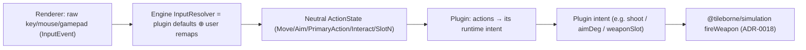

# ADR-0024: Gameplay input — neutral actions, control schemes + keybind remap

- Status: Proposed
- Date: 2026-06-04
- Deciders: Tileborne core team
- Tags: input, keybinds, control-scheme, runtime, plugin-boundary, settings-ui, ipc, boundary-test, research

## Context

ADR-0017 (petwars feature parity roadmap) row 15 ("Input maps & keybind settings") names this work **shared engine**: `packages/runtime` + renderer settings UI own the input infrastructure + persistence + remap UI; the BR / game-mode plugin declares its input maps via the `RuntimeInputMap` slot; `petwars-product` only optionally ships default keybind config (ADR-0017 "Ownership classification" row 15). The ADR-0017 follow-up table allocates this to the **ADR-0024** slot ("Gameplay IPC, HUD widgets + event stream contracts; input/keybinds attaches here", PlanDB `t-p1-input-keybinds-plan`).

This ADR is the **input/keybinds half** of the ADR-0024 slot and is **design only** — it defines the neutral action vocabulary, the resolver/control-scheme contract, how `RuntimeInputMapContribution` is consumed, the capture→intent flow, and the remap/persistence ownership. It implements no code. The neutral gameplay **wire-event stream** + **HUD widgets** (the rest of the ADR-0024 slot) are a sibling decision tracked separately (see "Scope + slot reconciliation"); ADR-0018 already deferred its result→wire concerns to that sibling.

### Current modeling reality (what we build on, not reinvent)

Tileborne ships **two parallel, disconnected input stacks**, and the one declarative slot meant to unify them is never consumed:

- **Generic runtime stack (unused for gameplay).** `packages/runtime/src/input/input.ts` already has the better primitives but no consumer: a `Button` bitmask (`Up/Down/Left/Right/Fire/Reload/Ability/Drop/Interact`, `:3-13`), raw `InputEvent` union (`key`/`mouseMove`/`mouseButton`/`gamepadAxis`, `:53-58`), an `InputState` accumulator, and `InputState.snapshot()` (`:102-127`) that **hardcodes** the raw→meaning mapping: `KeyA/ArrowLeft`→left, mouse-button-0→`Fire`, `KeyR`→`Reload`, `Space`→`Ability`, gamepad axis `0:0/0:1`→move. There is **no remap layer and no action vocabulary** — the binding is baked into `snapshot()`.
- **Renderer playtest stack (the live BR path).** `apps/desktop/src/renderer/components/playtest-viewport.tsx` captures DOM key/pointer events directly and **hardcodes `const SHOOT_KEY = 'Space'`** (`:63`), reading `pressedKeys.has(SHOOT_KEY)` into a BR-shaped `{ dir, shoot, aimDeg, weaponSlot }` payload (`:346-401`) sent over `runtime.playtestInput`. Helpers in `apps/desktop/src/renderer/lib/playtest-input.ts` (`movementKeysToDirection`, `parseWeaponSlotKey`, `computeAimDeg`) also bake key identities. This path **bypasses** `packages/runtime/src/input/input.ts` entirely.
- **The unused unification slot.** `RuntimeInputMapContribution` (`packages/plugin-api/src/contributions.ts:269-270`) exists on `RuntimeContributions.inputMaps` (`:322`) as a declarative slot with an untyped `JsonObject` `data`, and is **never decoded or consumed** anywhere — ADR-0017 row 15 explicitly flags it as "a declarative `RuntimeInputMap` slot, but no user keybind settings or plugin-declared maps wired".
- **Empty user-facing remap surface.** The shipped game-client `SettingsDialog` (`packages/game-client/src/components/settings-dialog.tsx:27`) has a "Controls" tab whose body is a static blurb ("Key remap, gamepad deadzone, aim sensitivity.") with no remap mechanism behind it.
- **The BR wire intent (downstream of actions).** The renderer payload is encoded to the plugin's `ClientInputFrame` (`encodeClientInputFrame`, resolved via `apps/desktop/src/renderer/lib/playtest-plugin-bridge.ts`); the BR projectile system reads it as `shoot`/`aimDeg`/`weaponSlot`. The plugin owns _its_ intent shape; the engine must stop at neutral actions and hand them off.

### Lessons (mirroring ADR-0018 / ADR-0019)

1. The **resolution mechanism** (raw event → neutral action, with per-user remaps and multiple bindings per action) is genuinely reusable and brand-neutral; it belongs in the engine.
2. The current slices bake **binding identity** (`SHOOT_KEY='Space'`, `mouse-0→Fire`) and a **closed `Button` bitmask** into the engine/renderer. The engine must own the _resolver + vocabulary as open data_, never a closed per-game binding. The action→intent mapping is **plugin** policy (the action `PrimaryAction` means "shoot" only because the BR plugin says so).

## Decision

Tileborne adopts a **neutral, three-stage input pipeline** owned by the engine: **raw capture → engine resolver (bindings + user remaps) → neutral actions**, after which the **plugin maps actions → its runtime intent → simulation**. The engine owns an **open action vocabulary**, an **InputMap/binding resolver**, a **control-scheme** model, the **remap UI + persistence**, and finally **consumes** `RuntimeInputMapContribution`. The plugin declares which actions it uses + default bindings per scheme + the action→intent mapping. This unifies the two parallel stacks into one and hard-cuts `SHOOT_KEY`/the baked `InputState.snapshot()` bindings.

### Owning package: `packages/runtime` (resolver + vocabulary) + renderer (remap UI) + `packages/core` (durable binding schema)

Per ADR-0017 row 15 and the dependency discipline established by ADR-0018/0019:

- **`packages/runtime/src/input/`** owns the **`InputResolver`** (raw `InputEvent` → neutral `ActionState`), the **control-scheme** model, and the seeded/deterministic-friendly resolution (worker-safe; the same resolver runs in the renderer playtest host and in `apps/game-host`). It replaces the baked `InputState.snapshot()` mapping.
- **`packages/core`** owns the **durable schemas + branded ids** for the action vocabulary and a saved binding set (`ActionId`, `BindingSetId`, `InputBinding`, `InputMap`), because user remaps + plugin default maps are durable, identity-bearing, worker-safe data (consistent with ADR-0019 putting durable schema in core, not in a systems package). The runtime resolver and the renderer settings UI both import these from core without a cycle.
- **renderer (`apps/desktop` + `@tileborne/game-client`)** owns the **remap UI** (the empty Controls tab) and drives **persistence** of user binding sets through existing app services/IPC. The renderer never names a binding literal; it edits the neutral `InputMap`.

### Neutral action vocabulary (open for extension)

A neutral, **open** action set as branded-string ids (NOT a closed enum — mirrors ADR-0019 `FamilyTag`/`OpenTag` so a new genre adds actions without engine edits). The engine ships a **baseline vocabulary** of well-known actions; plugins reference these and/or declare their own:

```ts
// packages/core/src/input/actions.ts (proposed)
export const ActionId = Schema.String.pipe(Schema.brand('ActionId')); // open, e.g. "core.PrimaryAction" | "myMode.Grapple"

// Baseline engine-shipped action ids (constants, not a closed Schema union):
export const CORE_ACTIONS = {
  Move: 'core.Move', // analog 2D vector (axes)
  Aim: 'core.Aim', // analog 2D vector / pointer-derived angle
  PrimaryAction: 'core.PrimaryAction', // "fire" / "attack" (the headline remap target)
  SecondaryAction: 'core.SecondaryAction',
  Interact: 'core.Interact',
  Reload: 'core.Reload',
  Dash: 'core.Dash',
  Slot1: 'core.Slot1' /* … SlotN */,
} as const;
```

Actions carry a **value kind** so the resolver knows how to fill them: `digital` (pressed/just-pressed/released edges), `analog1d` (−1..1), `analog2d` (vector, e.g. Move), or `pointer` (screen-space, e.g. Aim). The plugin declares which actions it uses and each action's value kind; the engine validates and resolves accordingly.

### Control-scheme model

A neutral `ControlScheme` tag (open branded string with engine-shipped baseline ids) selects which device families and binding shapes apply:

- `keyboard-mouse` — keys + mouse buttons + pointer-derived aim.
- `gamepad` — buttons + axes (stick/trigger), pointer-less aim from the right stick.
- `twin-stick` — left stick = Move, right stick = Aim, face/trigger buttons = primary/secondary.

A plugin declares **default bindings per scheme**; the user's active scheme + per-scheme remaps are persisted. The resolver is scheme-aware so the same action vocabulary is satisfiable from any device family. (Prior art: Excalibur composes keyboard+pointer+gamepad into one `InputHost`/`InputMapper`; Godot's `InputMap` allows multiple events per action across device families — see "References".)

### The InputMap / binding resolver contract

```ts
// packages/core/src/input/input-map.ts (proposed, durable schema)
class InputBinding extends Schema.TaggedClass(...)("InputBinding", {
  // one raw trigger bound to an action, scoped to a control scheme
  scheme: ControlScheme,
  action: ActionId,
  trigger: RawTrigger,   // tagged union: { _tag:"key", code } | { _tag:"mouseButton", button }
                         //              | { _tag:"gamepadButton", button } | { _tag:"axis", axis, sign } | { _tag:"pointer" }
  // for analog actions: which axis/sign this trigger contributes to
  axisRole: Schema.OptionFromUndefinedOr(Schema.Literals(["x+","x-","y+","y-"])),
}) {}

class InputMap extends Schema.Class(...)("InputMap", {
  id: BindingSetId,
  schemeDefaults: Schema.Record(ControlScheme, Schema.Array(InputBinding)),
}) {}
```

```ts
// packages/runtime/src/input/resolver.ts (proposed, pure + worker-safe)
// Holds the EFFECTIVE map = plugin defaults overlaid by user remaps.
interface ActionState {
  readonly digital: ReadonlyMap<
    ActionId,
    { pressed: boolean; justPressed: boolean; justReleased: boolean }
  >;
  readonly analog: ReadonlyMap<ActionId, { x: number; y: number }>; // analog1d uses x only
  readonly pointer: ReadonlyMap<ActionId, { x: number; y: number }>;
}
class InputResolver {
  constructor(effectiveMap: InputMap, scheme: ControlScheme) {}
  apply(event: InputEvent): void; // accumulate raw state (reuse InputState)
  resolve(tick: number): ActionState; // raw state -> neutral actions for this tick
}
```

The resolver is the **single** place raw events become meaning. It reuses the existing `InputState` accumulator (`packages/runtime/src/input/input.ts`) but the **mapping table is data** (`effectiveMap`), not the baked `snapshot()` switch.

### How `RuntimeInputMapContribution` is consumed

The currently-unused slot (`packages/plugin-api/src/contributions.ts:269-270`) is given a **typed `data` shape** decoded + validated against the `@tileborne/core` `InputMap` schema (mirroring how ADR-0019 typed `RuntimeGameObjectCatalogContribution` and ADR-0018 typed `RuntimeWeaponCatalogContribution`; the untyped `JsonObject` path is hard-cut, pre-release). The plugin declares, per control scheme:

1. the **actions it uses** + each action's value kind, and
2. the **default bindings** for those actions per scheme.

The engine (a new `input-map-registry` helper next to `catalog-registry.ts`) decodes the contribution, builds the plugin's default `InputMap`, **overlays the user's persisted remaps**, and feeds the resulting _effective map_ into the `InputResolver`. Plugins ship **defaults + vocabulary**; the engine owns the **resolver, remap UI, and persistence**.

### The full capture → intent flow (and how it unifies the two stacks)



- The **renderer** stops interpreting keys. It captures raw `InputEvent`s and feeds the engine `InputResolver`. `SHOOT_KEY='Space'`, `movementKeysToDirection`, and the `InputState.snapshot()` baked bindings are **hard-cut**.
- The **`InputResolver`** produces a neutral `ActionState` (one stack, replacing both the unused generic `Button` snapshot path and the renderer's ad-hoc capture).
- The **plugin** owns the **action→intent adapter** (e.g. BR maps `PrimaryAction.justPressed`→`shoot`, `Aim.pointer`→`aimDeg`, `Slot1..N`→`weaponSlot`, `Move`→`dir`), producing its existing `ClientInputFrame`. The engine never knows what an action "does".
- The **simulation** (ADR-0018) consumes the plugin intent as today.

This resolves the **two-parallel-stacks problem**: there is exactly one capture→action stack in the engine (`InputResolver` over `InputEvent`), and the plugin's intent shape (`ClientInputFrame`, `Button` bits if it wants them) is downstream of neutral actions, not a competing parallel reader of raw input.

### Concrete acceptance example (the headline result)

> A user opens **Settings → Controls**, rebinds **`PrimaryAction`** from `Space` to **mouse left-click**, and saves. The remap is persisted as a user `InputMap` overlay. On next playtest, the engine resolver maps mouse-button-0 (not `Space`) to `PrimaryAction`; the BR plugin's action→intent adapter turns `PrimaryAction.justPressed` into `shoot=true`; **the player now shoots on mouse click instead of spacebar — with no plugin or engine code change, only the persisted binding overlay.**

### Remap UI + persistence ownership

- The **Controls tab** (game-client `SettingsDialog` + the desktop settings surface) renders a generic remap editor over the _effective `InputMap`_: list actions for the active scheme, capture a new raw trigger per action, validate conflicts, and save. It names no binding literal.
- **Persistence** of the user binding-set overlay is owned by app services/IPC (renderer never touches disk directly, per ADR-0003). The overlay is keyed per user/project and applied on top of plugin defaults at resolve time.

## Scope + slot reconciliation

The ADR-0017 follow-up table allocates ADR-0024 to "Gameplay IPC, HUD widgets + event stream contracts" with "input/keybinds attaches here". This ADR is the **input/keybinds** decision under that slot. The neutral **gameplay wire-event stream** (`tileborne:gameplay:events`, deferred from ADR-0018 §"How results reach rendering") and **HUD widgets** are the remaining ADR-0024-slot content and are tracked as a **sibling ADR (ADR-0024b / a renumbered follow-up)**; this ADR does not define them. The ADR-0017 table + README index are updated to mark ADR-0024 written with this scope and to note the HUD/event-stream sibling remains open.

## Plugin-neutral architecture

| Concern                                              | Runtime owner                               | First-fix owner                                                                 | Canonical long-term owner                                               |
| ---------------------------------------------------- | ------------------------------------------- | ------------------------------------------------------------------------------- | ----------------------------------------------------------------------- |
| Raw capture (`InputEvent`)                           | renderer playtest viewport / runtime client | `playtest-viewport.tsx` DOM listeners + `runtime/src/input/input.ts`            | renderer capture + `packages/runtime/src/input` (`InputEvent` reused)   |
| Action vocabulary + binding/map schema + branded ids | resolver load + remap UI + plugin decode    | none (new)                                                                      | `packages/core` (`src/input/`)                                          |
| Raw → neutral action resolver + control schemes      | runtime/worker tick paths                   | baked `InputState.snapshot()` (`runtime/src/input/input.ts:102-127`)            | `packages/runtime/src/input` (`InputResolver`)                          |
| `RuntimeInputMapContribution` decode/overlay         | runtime + editor/registry                   | unused slot `contributions.ts:269-270`                                          | `packages/plugin-api` (typed slot) + an `input-map-registry` helper     |
| Action → plugin runtime intent                       | plugin runtime adapter                      | hardcoded `shoot/dir/aimDeg` in `playtest-viewport.tsx` + BR `ClientInputFrame` | `packages/plugin-battle-royale` (and future mode plugins)               |
| User remap UI + persisted binding overlay            | renderer settings + app services            | empty Controls tab (`settings-dialog.tsx:27`)                                   | renderer (`apps/desktop` + `@tileborne/game-client`) + app IPC services |
| Default bindings per scheme + action set declared    | plugin contribution                         | n/a                                                                             | plugin (`RuntimeInputMapContribution`)                                  |
| petwars-product                                      | (consumes)                                  | —                                                                               | optional default keybind config only; no logic (ADR-0017 row 15)        |

Forbidden edges and required boundary tests:

- `packages/core/src/input/**` and `packages/runtime/src/input/**` must not import `packages/plugin-battle-royale`, `apps/desktop`, `apps/game-host`, private petwars paths, or contain `petwars`/`grassland`/`erw:`/`.pwmap`/plugin-name literals.
- **No baked binding literals in the engine**: boundary test asserts no `'Space'`/`SHOOT_KEY`-style key-identity constants in `packages/runtime/src/input/**`; bindings come only from a decoded `InputMap` (plugin defaults ⊕ user overlay). The action vocabulary is **open branded strings**, not a closed literal union (no closed `Button` re-introduction as the contract).
- **Worker-safe:** the resolver has no React/Pixi/Electron/`node:fs`; it runs in the renderer host and in `apps/game-host`. Renderer remap UI is the only place DOM capture lives.
- The engine must **not** name what an action _does_: no `shoot`/`reload` semantics in `packages/core`/`packages/runtime` input code — only neutral action ids + value kinds. The action→intent mapping is plugin-only.
- Effect v4: `Schema.Class` for `InputMap`, `Schema.TaggedClass` for `RawTrigger`/`InputBinding` variants, `Schema.TaggedErrorClass` for decode/conflict failures, branded ids (`ActionId`, `BindingSetId`) from `@tileborne/core`.
- Boundary tests: forbidden-token + no-baked-binding + open-vocabulary + worker-safe import checks on the input modules; a "remap round-trip" determinism check (same effective map + same raw event log → same `ActionState`).

## Migration impact on Battle Royale

- BR gains a `RuntimeInputMapContribution` declaring its actions (`Move`, `Aim`, `PrimaryAction`, `Reload`, `Slot1..5`, `Interact`) + default `keyboard-mouse` bindings that **reproduce today's behavior** (`Space`/mouse-0 → `PrimaryAction`, WASD/arrows → `Move`, `R` → `Reload`, digits → `SlotN`, pointer → `Aim`).
- BR adds an **action→intent adapter** that produces its existing `ClientInputFrame` from `ActionState` (no change to the BR wire format or projectile system).
- The renderer's `SHOOT_KEY`, `movementKeysToDirection`, and `InputState.snapshot()` baked mappings are removed (hard-cut). Deterministic replay parity: the resolver+adapter must yield the same `ClientInputFrame` stream as today for the default map.

## Definition of done (for this ADR / the design)

- ADR-0024 written in MADR-lite style (Proposed) and indexed in `docs/adrs/README.md`; ADR-0017 follow-up table marks it written (input/keybinds scope) and notes the HUD/event-stream sibling open.
- Neutral action vocabulary, control-scheme model, `InputMap`/`InputResolver` contract, `RuntimeInputMapContribution` consumption, the capture→intent flow + two-stack unification, the remap/persistence ownership, and the acceptance example recorded.
- Key decisions captured as PlanDB `decision`/`constraint` contexts.
- Implementation slices enumerated (below) for a follow-up `code` subgraph; **no code implemented** here.

## Implementation slices (follow-up `code` tasks)

All shared-engine unless noted. Boundary tests gate the BR migration per ADR-0017 DoD. Pre-release hard-cuts allowed.

1. **(core)** `packages/core/src/input/` — `ActionId`/`BindingSetId` branded ids, `CORE_ACTIONS` baseline, `RawTrigger`/`InputBinding`/`InputMap` schemas, action value-kind. `vitest --run` schema round-trips.
2. **(runtime)** `InputResolver` + control-scheme model over the existing `InputEvent`/`InputState`; replace the baked `InputState.snapshot()` mapping with data-driven resolution. `vitest --run` raw→action resolution + remap-overlay determinism.
3. **(plugin-api)** Type `RuntimeInputMapContribution.data` against the core `InputMap` schema + an `input-map-registry` (decode + plugin-defaults⊕user-overlay merge). Hard-cut the untyped `JsonObject` path.
4. **(renderer)** Wire raw capture in the playtest viewport to feed the resolver; hard-cut `SHOOT_KEY`/`movementKeysToDirection`/baked snapshot. Build the Controls-tab remap editor + persistence via app IPC services.
5. **(boundary-tests)** Forbidden-edge / no-baked-binding / open-vocabulary / worker-safe tests on the input modules; resolver determinism test.
6. **(plugin — BR)** Add the BR `RuntimeInputMapContribution` (default bindings reproducing today) + an action→intent adapter producing the existing `ClientInputFrame`. Deterministic replay parity vs current behavior; ship the "PrimaryAction Space→mouse" acceptance test.

Slices 1–5 are **shared engine**; slice 6 is **BR plugin** (proves neutrality by declaring its map + adapter through the public slot). `petwars-product` consumes the result and may ship an optional default keybind config, no logic.

## Downstream unblocked / relationships

- Directly delivers ADR-0017 row 15 (input maps & keybind settings) and the headline "shoot on mouse vs spacebar" remap.
- Feeds the genre-neutrality proof in ADR-0023: a second sample genre plugin declares its **own** actions (e.g. a Zelda-like `Interact`/`Dash`/melee `PrimaryAction`) through the same slot with zero engine edits.
- Sibling within the ADR-0024 slot: the neutral gameplay **wire-event stream** + HUD widgets (deferred from ADR-0018) consume the same neutral-action discipline but are a separate decision.

## References / prior art

Mined from the curated `tileborn` reference cache (`~/Library/Caches/search-context/refs/`) per the search-context skill. Patterns extracted, not code copied.

- **Excalibur — `excaliburjs__Excalibur/src/engine/Input/input-mapper.ts:15-57`** (`InputMapper.on(inputHandler, commandHandler)`) + **`input-host.ts:14-58`** (`InputHost` composes `keyboard` + `pointers` + `gamepads`). The canonical _raw-query → command_ indirection: multiple input sources (keyboard held / gamepad button / axis) map to one logical command. Direct prior art for "many raw triggers → one neutral action" and for a single host composing all device families. We adapt it to **data-declared** bindings + per-user remaps rather than imperative `.on(...)` handlers.
- **Phaser — `phaserjs__phaser/src/input/keyboard/KeyboardPlugin.js:443-468`** (`addKeys({ up: KeyCodes.W, down: KeyCodes.S })`), **`keys/KeyCodes.js`** (named key vocabulary), **`keys/JustDown.js`** (pressed/just-pressed edge), **`combo/KeyCombo.js`**. Prior art for a _named-action → key_ binding object and the digital edge semantics (`pressed`/`justPressed`/`justReleased`) our `ActionState` exposes.
- **GDevelop — `4ian__GDevelop/GDJS/Runtime/inputmanager.ts`** + **`events-tools/inputtools.ts`**. A centralized `InputManager` queried by name _above_ raw keys; reinforces a single engine-owned input layer that gameplay queries by logical name rather than reading raw devices directly.
- **Godot `InputMap`** (well-known engine pattern; conceptual, not in the cache): named _actions_, multiple _events_ per action across device families, runtime remap + project persistence. This is the closest match to the action-vocabulary + per-scheme-bindings + remap/persist model adopted here.

What to study, not copy: the _indirection shape_ (raw → logical action) and _multiple bindings per action across schemes_. What to avoid: Excalibur's imperative handler registration (we use declared data + overlay) and any closed key/button enum as the public contract (our vocabulary is open branded strings).

## Risks and mitigations

1. **Over-generalized engine** (ADR-0017 Risk 2). Mitigation: ship only the baseline action value-kinds + three control schemes BR needs today and plausibly a second genre; the action _set_ is open data, not engine-baked.
2. **Binding literals leaking into the engine.** Mitigation: no-baked-binding boundary test; bindings exist only as decoded `InputMap` data.
3. **Two stacks re-diverging.** Mitigation: hard-cut the renderer's ad-hoc capture + `InputState.snapshot()` baked mapping in the same migration; one resolver is the only raw→action path.
4. **Engine learning gameplay semantics.** Mitigation: action→intent mapping is plugin-only; boundary test forbids `shoot`/`reload` semantics in core/runtime input code.
5. **Remap persistence/identity drift.** Mitigation: durable `BindingSetId` schema in core; user overlay applied on top of plugin defaults at resolve time (no destructive merge).
6. **Determinism regressions in replay.** Mitigation: resolver is pure over `(effectiveMap, scheme, InputEvent log)`; round-trip determinism test mirrors the ADR-0018 fixed-seed discipline.
